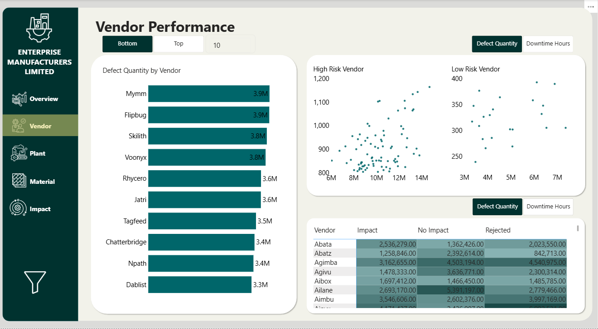
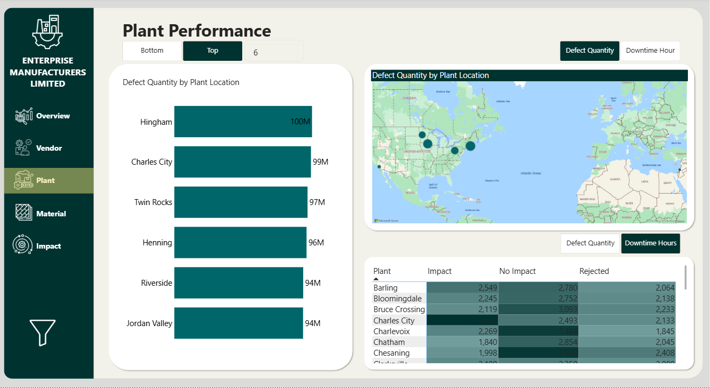
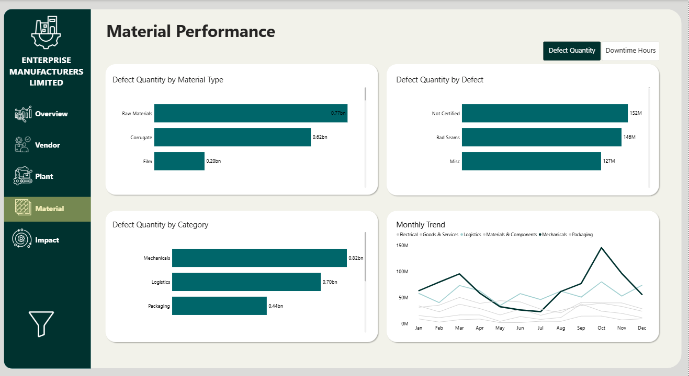
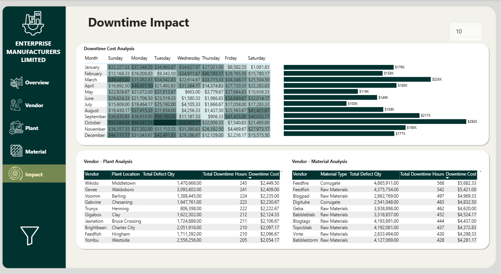
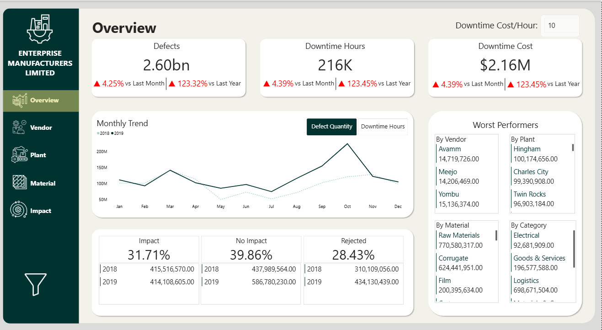

# Supplier-Quality-and-Performance-Project

In this project, I unified supplier quality data, built performance metrics, and benchmarked vendors to surface high-risk suppliers and operational inefficiencies that shaped procurement decisions.

## **Project Overview**
Manufacturing operations rely on external suppliers for critical materials, yet the organization lacked an evidence-based method to evaluate supplier quality or understand the operational consequences of defects across plants. This project transforms fragmented supplier quality data into decision-grade intelligence to guide procurement strategy and reduce downtime-related losses.

## **Purpose**
**Primary Goal:** Benchmark supplier performance using quantitative quality metrics and comparative analysis to support more objective vendor decisions and operational improvements.

**Secondary Goal:** Surface hidden inefficiencies by examining the interaction between vendors, materials, and plants — an operational blind spot prior to this analysis.

## **Technical Stack**
- **Power BI** — data modeling, interactive analytics, DAX metrics
- **Power Query** — ETL, cleaning, formatting, standardization
- **DAX** — metric engineering (defect severity, downtime impact, cross-plant variance)
- **Excel / CSV** — upstream operational data sources

## **Data Characteristics**
The consolidated dataset includes:
- Vendor
- Plant
- Material
- Defect quantity
- Downtime minutes (severity proxy)
- Time attributes (where available)

The dataset originated from multiple plants, requiring standardization and transformation before comparative benchmarking was feasible.

## **5. Analytical Narrative & Key Questions**

### **Business Problem**
Supplier quality issues cause operational downtime, slow production cycles, and increase cost of failure. However, without standardized metrics, performance reviews were anecdotal — high-risk suppliers blended into averages, and procurement lacked defensible insights for negotiation or exit decisions.

### **Analytical Questions**
The analysis sought to answer:
1. Which vendors cause the most defects?
2. Which vendors are most responsible for downtime?
3. Where do vendor–material combinations systematically underperform?
4. Does performance shift across plants for the same vendor?
5. Where does operational risk concentrate — and why?

These map directly to procurement risk, operational reliability, and cost containment.

## **Analytical Approach**

### **Data Structuring & Metric Engineering**
- **Defect Metrics:** to quantify failure frequency
- **Downtime Metrics:** to quantify failure severity
- **Performance Rankings:** to benchmark suppliers
- **Cross-Plant Variance:** to detect instability and inconsistency
- **Vendor–Material Interactions:** to expose systemic coupling failures

This reframed supplier evaluation as a **quantitative performance problem**, not a compliance exercise.

## **Visual Storytelling & Analytical Findings**
### **A. Identifying High-Risk Suppliers**

The first layer surfaced vendors with disproportionate downtime relative to defect count — an early signal of systemic quality failures.

### **Understanding Cross-Plant Variability**

Comparing supplier performance across plants revealed significant variance — showing that the same vendor could operate reliably in one facility but fail in another, indicating process, handling, or specification differences.

### **Vendor–Material Systemic Underperformance**

Analyzing vendor–material pairings uncovered combinations that consistently failed, enabling procurement to consider substitution, renegotiation, or vendor exit.

### **Operational Consequence Mapping**

Linking downtime to supplier decisions reframed quality issues as **cost and reliability risks**, not isolated operational incidents.

## **Business Impact & Decision Levers**

The analysis generates leverage across multiple business functions:

| Functional Area | Decision Insight |
|---|---|
| **Procurement** | Which suppliers to renegotiate, retain, switch, or exit |
| **Operations** | Where downtime risk concentrates & where mitigation yields impact |
| **Quality** | Which material + vendor pairings require escalation |
| **Finance** | Converts downtime into economic consequence |
| **Strategy** | Enables data-backed vendor portfolio optimization |

The core transformation: **subjective supplier opinions → objective supplier intelligence**.

## **Key Takeaways**
- Supplier quality can be measured, ranked, and benchmarked using performance metrics.
- High-severity downtime is not always correlated with high defect volume.
- Supplier performance varies across plants — a hidden inefficiency until quantified.
- Vendor–material interactions reveal systemic failure patterns missed in averages.
- A standardized analytical framework enables repeatable supplier evaluation.

## **Visuals**

  
  
  
  
  
  

## **11. Summary**
This project demonstrates how fragmented operational data can be converted into a procurement and risk decision tool using structured analytical methods. Beyond visualization, the work extracts insights that influence supplier negotiations, budget allocation, and operational reliability showing the role data plays in reducing downtime and improving manufacturing resilience.
